This challenge required digging through multiple write-ups on Zoom forensics and its local databases to understand how calls, meetings, and configs are stored on disk.

## Secret Meeting [hard]

Description:

> After a silent raid on a hillside shrine, Shiori is called to examine the suspect’s abandoned workstation, its drives wiped clean, its trails burned to silence.  
> Yet the forest remembers what men forget. Within the machine's shadow copies, she traces the faint echoes of deleted files, fragments of a conversation that should not exist.
> Deep beneath layers of encryption lies an application, sealed like a lacquered box, its contents whispering of hidden meetings and names long erased.
> To reveal the truth, Shiori must coax the past from its own reflection, recover what was meant to vanish, decrypt what was meant to remain unheard, and expose the voice behind the silence.

Here we are given disk Image and Windows memory dump both will help us during our solving steps

First we mounted the image using FTK Imager and then took a look at it in Autopsy.

## Q1 → When was the private communications application installed? Provide the exact installation timestamp in UTC (YYYY-MM-DD HH:MM:SS).

I extracted NTUSER.DAT for the user a1l4m from

`D:\Users\a1l4m\NTUSER.DAT`

Opened it using Registry Explorer and checked :

`HKCU\Software\Microsoft\Windows\CurrentVersion\Uninstall\ZoomUMX`

This key corresponds to Zoom Workplace for that user. Registry Explorer shows the key’s Last Write timestamp as:

`2024-12-17 08:51:01 (UTC)`

The `DisplayName` and `DisplayVersion` fields confirm it’s Zoom Workplace 6.3.0 (52884), and there are no older Zoom uninstall entries for this profile. Because the Uninstall key is created/updated at install time, its Last Write time is a strong indicator of the installation event.

## Q2 → It seems Khalid took steps to cover his tracks. A forensic review of the system reveals he used a tool specifically designed to erase digital evidence. What tool did he use?

I searched the memory dump using `strings` and found clear evidence that he used `sdelete.exe`

`strings memory.raw | grep -i "sdelete"`


so the answer is :

> sdelete

## Q3 → Investigators located a previous system snapshot of Khalid’s machine, preserving data before his deletion attempt. When was this snapshot saved? Provide the exact timestamp in UTC.

I thought We can get it from

`D:/System Volume Information`

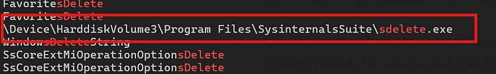

From here I initially got a creation time of 2025–03–06 17:17:32 UTC. I later realized this was confusing, so I parsed the $MFT

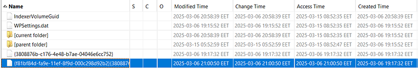

That was the same to be more precise I tried to use vshadowinfo command to be more definite

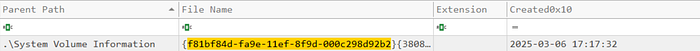

> 2025–03–06 17:17:33
>
> just one sec difference :)

## Q4: What is the meeting ID for Khalid’s meeting?

I spent hours on this question, reading multiple write-ups and trying to reproduce their techniques.

First I recommend to read these before solving:

* An article on decrypting Zoom encrypted chat databases and how DPAPI + app keys are used to protect local SQLite data.
* https://infosecwriteups.com/decrypting-zoom-team-chat-forensic-analysis-of-encrypted-chat-databases-394d5c471e60
* A GitHub write-up on extracting the Zoom Personal Meeting ID (PMI) from a forensic disk image, which shows where IDs live and how to carve them out.
* extract_zoom_PMI_from_Forensic_disk_image/Zoom_PMI_extraction.png at main ·…
* How to extract the zoom Personal Meeting ID from a Forensic disk image …

github.com

And I remembered there was a challenge on HTB named crewcrow this was dealing with zoom database decryption which we need in this challenge too here it is a write-up for it

* https://medium.com/@chaoskist/hackthebox-sherlocks-write-up-crewcrow-zoom-database-decryption-f2da9d88bb46

We should follow this:

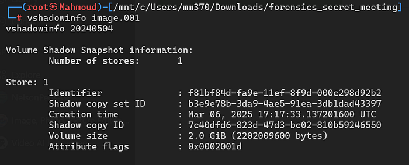

The surprising thing was that `zoom.us.ini` and the Zoom database had been deleted, so I had to recover them first. I tried several recovery tools without success, so I finally mounted the image’s Volume Shadow Copy using `vshadowmount`.

and here we got the two files we need

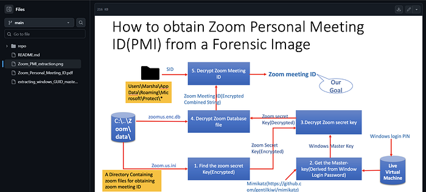

I copied them to my local working directory and took a closer look at them:

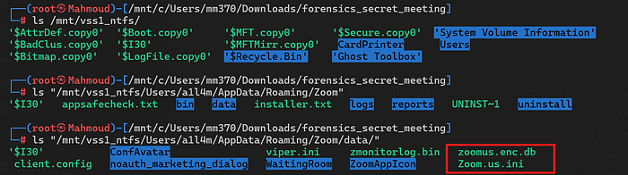

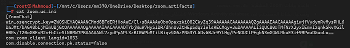

`win_osencrypt_key`

* `Zoom.us.ini` – configuration file containing `win_osencrypt_key `
* `zoomus.enc.db` – the encrypted Zoom database

The `win_osencrypt_key` value is a DPAPI-protected Zoom application key, base64-encoded. Zoom uses this key to encrypt its local databases (`zoomus.enc.db`, encrypted memlogs, etc.), so recovering and decrypting this blob is the prerequisite to getting at any meeting metadata.

Note that these files were no longer present on the live volume, but they were fully intact in the Volume Shadow Copy I mounted with `vshadowmount`, which is why VSS analysis was essential for this challenge.

So to decrypt Zoom’s `win_osencrypt_key` from `Zoom.us.ini`, I first needed the user’s DPAPI master keys.

This is why we were given a memory dump: we don’t have to rely only on disk artefacts for DPAPI. Instead, we can go straight after `lsass.exe` in RAM.

> LSASS is the Windows security subsystem that handles logons, credentials, and DPAPI, so while the user is logged in it holds the decrypted DPAPI master keys in its process memory.
>
> By carving/extracting `lsass.exe` from `memory.raw` and running DPAPI-aware tools against it, we can recover the user’s master keys and later use them to decrypt Zoom’s `win_osencrypt_key` from `Zoom.us.ini`.

Using Volatility didn’t help me at all in extracting the minidump, so I moved on to MemProcFS — but there was an issue: by default it does not extract the `lsass.exe` process for security reasons.

So I kept searching untill I found this helpful write-up for Eljo0ker using this tool and modifying it to be used in a proper way I recommend you check it → `Eljo0ker’s-Writeup`

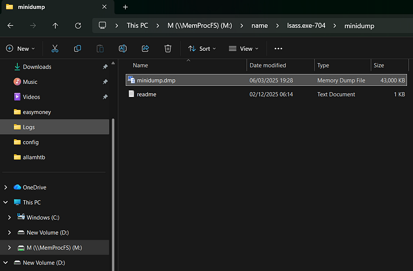

`.\MemProcFS.exe -device "C:\Users\mm370\Downloads\forensics_secret_meeting\memory.raw" -forensic 1`

So going through `M:\name\lsass.exe-704\minidump` :)

I copied minidump.dmp file to my analysis folder as `lsass.dmp` and then switched to mimikatz to extract DPAPI secrets from that offline dump.

Here we got the DPAPI master keys what we need in the next step to decrypt the `win_osencrypt_key` blob from `Zoom.us.ini`, and ultimately to unlock `zoomus.enc.db` and recover the meeting ID.

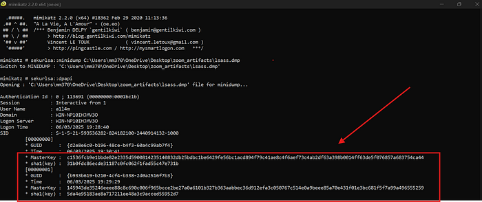

Now we need to turn the text value in `Zoom.us.ini` into a raw DPAPI blob that Mimikatz can decrypt. So in the powershell:

```powershell
$ini = Get-Content "C:\Users\mm370\OneDrive\Desktop\zoom_artifacts\Zoom.us.ini"
$line = $ini | Where-Object { $_ -like "win_osencrypt_key=*" }
$blob_b64 = $line.Split("=",2)[1]
[IO.File]::WriteAllBytes("C:\Users\mm370\OneDrive\Desktop\zoom_artifacts\win_osencrypt_key.bin",
    [Convert]::FromBase64String($blob_b64))
```

Now we have a DPAPI blob file located at:

`C:\Users\mm370\OneDrive\Desktop\zoom_artifacts\win_osencrypt_key.bin`

Now that I had the DPAPI blob on disk, the next step was to decrypt it using the user’s DPAPI master key from LSASS.

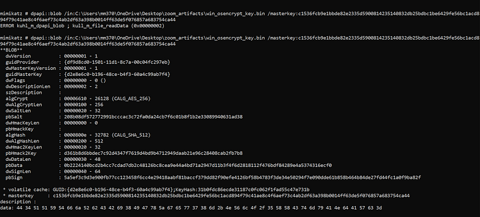

Mimikatz successfully parsed the DPAPI structure (AES-256 + SHA-512) and, at the bottom of the output, exposed the decrypted payload in hex:

`data: 44 34 51 51 59 54 52 62 4a 52 69 38 49 7a 5a 3a 65 57 77 37 38 3d 6d 2b 4e 56 6c 4f 2f 35 58 58 43 74 64 79 41 4e 64 41 57 63 3d`

Converting those bytes to ASCII gives:

`D4QQYTfjRbCBi8IGxZgew78m+NVlO/5XXCtmyANdAWc=`

After decoding it to a raw key:

```bash
zoomSecretB64="D4QQYTfjRbCBi8IGxZgew78m+NVlO/5XXCtmyANdAWc="
printf '%s' "$zoomSecretB64" | base64 -d > zoom_secret_key.bin
```

The resulting `zoom_secret_key.bin` is the AES key required to decrypt `zoomus.enc.db`

I tried working with SQLCipher from the terminal, but I kept getting errors. After revisiting the Crewcrow write-up, I tried using DB Browser for SQLCipher instead, and that worked.

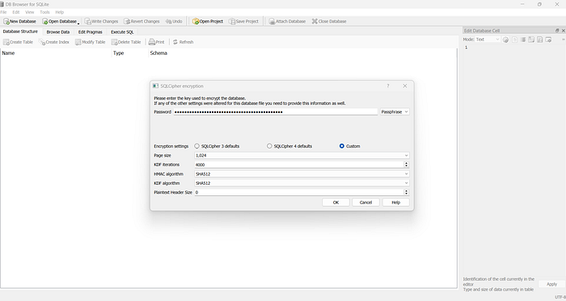

The meeting ID should be stored under `zoom_kv`.

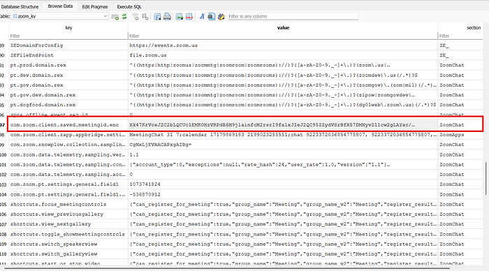

We can see we’re still in an “encryption loop” — this value itself is encrypted and needs to be decrypted as well.

`Xk47KrVoeJZC2bLQCUc1EMKOHzVRPdB6M9jlainfcM2rsrI9fxlxJIeJ2QC95ZZydVSrBfX57DMNyvZ11cw2gLAYac/5wldVpzLyNdbsQvg=`

These Zoom client secrets are encrypted with AES-256-CBC using a key derived from the Windows user’s SID.

The scheme is:

— Key = SHA-256( SID as bytes )
— IV = first 16 bytes of SHA-256(key)

I took the SID of the target account (`S-1-5-21-593536282-824182100-2440914132-1000`), fed it into a short Python helper script to derive the AES key and IV, then used that pair to decrypt the Base64 value stored in `com.zoom.client.saved.meetingid.enc`

```python
import hashlib
from base64 import b64decode
from Crypto.Cipher import AES

sid = b"S-1-5-21-593536282-824182100-2440914132-1000"

# 1) Derive key + IV
key = hashlib.sha256(sid).digest()
iv = hashlib.sha256(key).digest()[:16]

print("[*] AES key:", key.hex())
print("[*] IV     :", iv.hex())

# 2) Encrypted value from zoom_kv: com.zoom.client.saved.meetingid.enc
enc_b64 = "Xk47KrVoeJZC2bLQCUc1EMKOHzVRPdB6M9jlainfcM2rsrI9fxlxJIeJ2QC95ZZydVSrBfX57DMNyvZ11cw2gLAYac/5wldVpzLyNdbsQvg="

ciphertext = b64decode(enc_b64)

cipher = AES.new(key, AES.MODE_CBC, iv)
plaintext = cipher.decrypt(ciphertext)

# Zoom usually stores this as ASCII with padding (\x00 or PKCS#7) – strip it
meeting_id = plaintext.rstrip(b"\x00").decode(errors="ignore")
print("[+] Decrypted meeting ID:", meeting_id)
```

The result was :

`81909669601|AnonymousAllamTheSeekerOfTruth's Zoom Meeting;100000`

So our answer finally is : 81909669601

Take a breath and let’s tackle the last question, which is

## Q5 → How long did Khalid remain in the meeting? Provide the duration in seconds.

From the registry hives you can get a “focus time”, but don’t be misled by that — it reflects how long Zoom was running, not how long Khalid stayed in the specific meeting.

So by checking ActivitiesCache found in

`D:\Users\a1l4m\AppData\Local\ConnectedDevicesPlatform\L.a1l4m\ActivitiesCache.db`

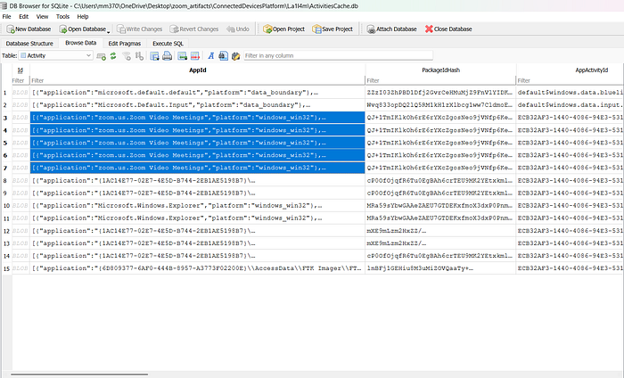

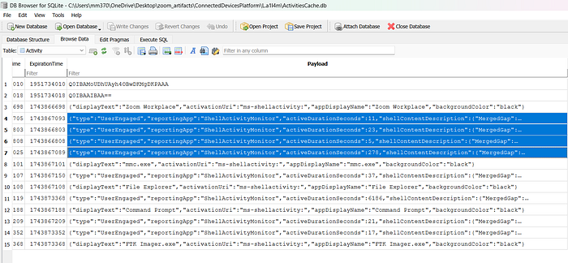

So the realistic answer is 278 and yes, that’s the correct one..

Here we go -_- feel free to reach out to me for any clarification.

……………..

I hope you enjoyed this write-up and found everything easy to follow.

Let me know if you have any feedback!

………………
